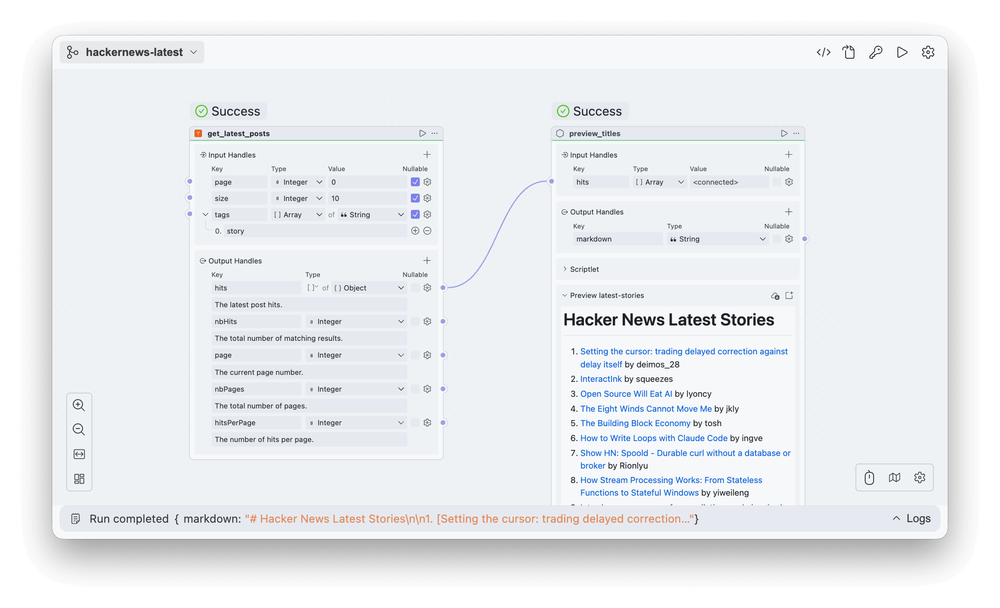

# Open Flow

Open Flow defines portable workflow contracts, a shared Workbench runtime, a public CLI runtime,
and Open Flow Server for self-hosting. The selected deployment owns Projects, immutable Project
Revisions, validation, Runs, Publications, Live pointers, and execution history. Workbench and CLI
are clients of its Control API; neither owns a second local Project format or silently falls back
to another deployment.

<p align="center">
  <picture>
    <source media="(prefers-color-scheme: dark)" srcset="./docs/assets/dark.png">
    <source media="(prefers-color-scheme: light)" srcset="./docs/assets/light.png">
    
  </picture>
</p>

> [!IMPORTANT]
> Open Flow is under active development and has not reached its first public release.

The current product boundary and HTTP contracts are documented in
[the architecture guide](docs/architecture.md) and
[the Control API contract](docs/control/contracts/control-api.md).

## Self-host Open Flow

```bash
docker build --file apps/server/Dockerfile --tag open-flow-server:dev .
docker run --rm \
  --publish 3000:3000 \
  --env OPEN_FLOW_OPERATOR_TOKEN=replace-with-at-least-32-random-bytes \
  --volume open-flow-data:/data/open-flow \
  open-flow-server:dev
```

Open `http://127.0.0.1:3000` after the container becomes healthy. Open Flow Server runs without a
Connector or LLM provider by default; capabilities that have no configured host fail closed.

## Repository Development

```bash
bun install --frozen-lockfile
bun run dev
bun run check
bun run test
bun run build
bun run test:package
```

`bun run dev` starts the Server API and Workbench development composition. Run
`bun run test:docker` when Docker is available to exercise the release image, Isolated VM,
Workbench, graceful shutdown, and SQLite volume recovery.

[Read the documentation.](docs/README.md)

## License

[Apache-2.0](LICENSE)
